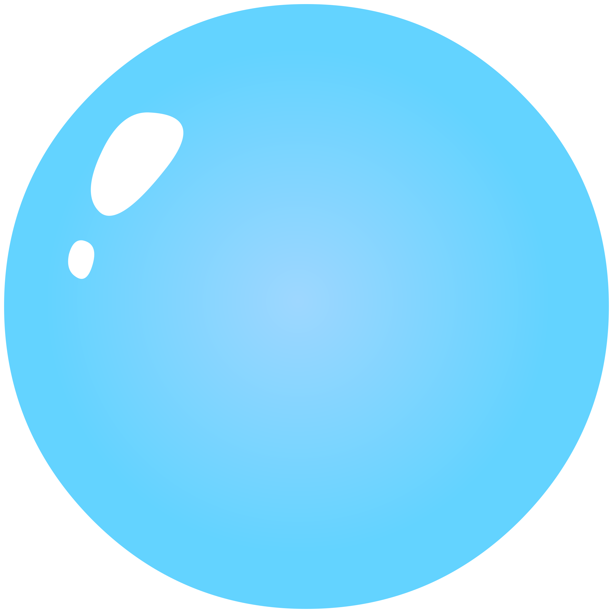
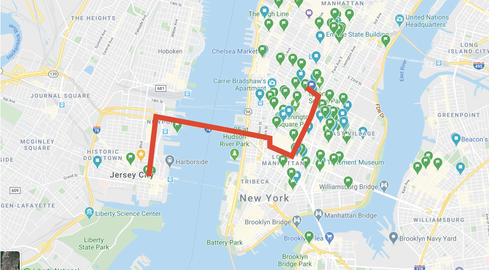
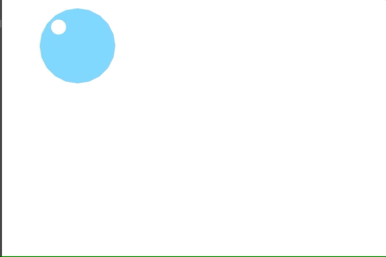
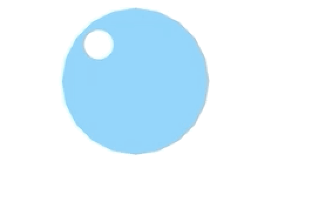
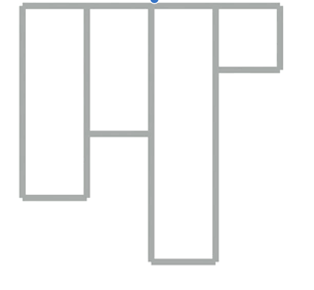
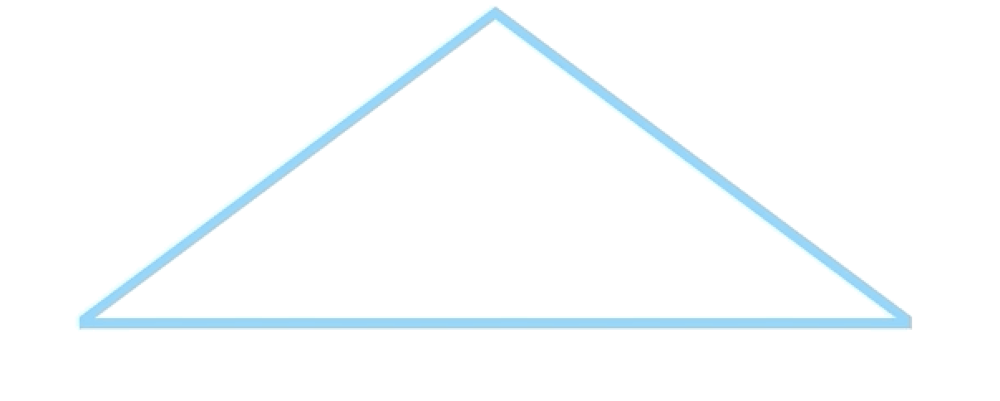
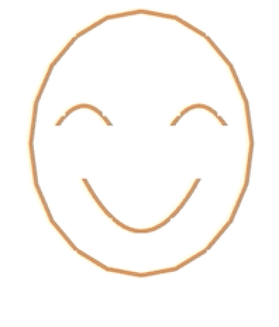

# OF_Ass3
## Project 1
### A story of a humanized bubble born from a bath, and the bubble travel through different windows of the apartment and finally broken.

Who is the user?
	General audience
What do you want them to experience?
	I want them to experience the fun of the story and the traveling experience of the bubble.
How will your translation achieve this?
	I will translate that through the use of colors and background music. 
    

## Project 2
### I want to abstract a week of my daily movement by using google map API. By looking at the geometric lines and graphics, I hope that I can translate a human movement into a motion graphics.
Who is the user?
	General audience
What do you want them to experience?
	I want them to experience the the range of my daily pattern 
How will your translation achieve this?
	I will translate that my daily movements into patterns and lines.
       

## Project 3
### I want to create an interactive installation by incorporating Arduino or raspberry pi. It will be an animated face on the screen where will be controlled by the sensors attached to Arduino/raspberry pi. The user can control the face movement by changing their behavior such as voice/distance/touch, etc.
Who is the user?
	General audience
What do you want them to experience?
	I want them to confidently interact with the controller and find out how to interact with the screen.
How will your translation achieve this?
	Translating user input by using the hardware and then connect to the animation by OF on the screen. 
   
   
   ## OF drawings
   ###    
   

         
            
               
